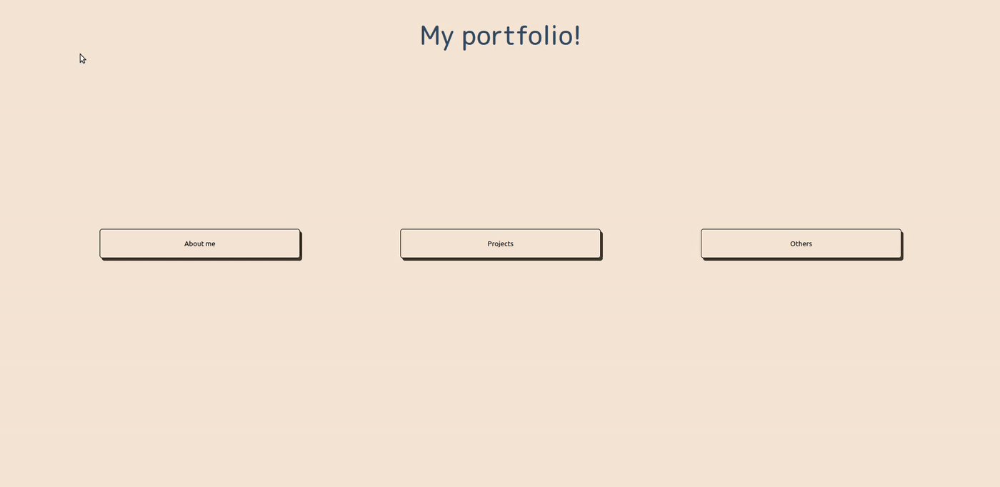

# My portifolio!
My portifolio!

 

## to-do
- Use static-i18n to make my life easier with i18n;
- lazy-loading images. now. (of course, avoiding CLS..). <a href="https://web.dev/articles/lazy-loading-video?hl=pt-br">videos too</a> (or not, webp with minimal JS);
- Update about-me text (I'm 26 now!).
